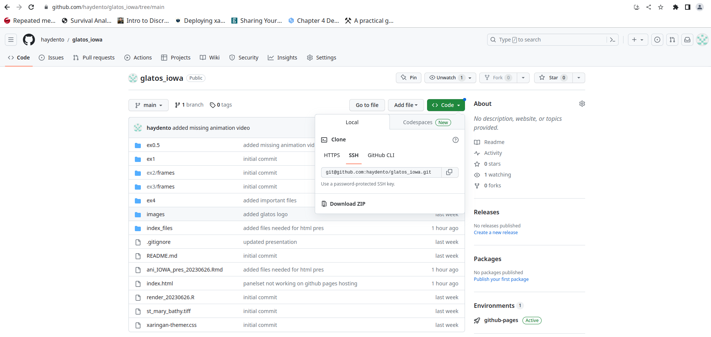

```{r setup, xaringan-themer, include=FALSE, warning=FALSE}
library(xaringanthemer)
style_mono_light(
  base_color = "#23395b",
  header_font_google = google_font("Josefin Sans"),
  text_font_google   = google_font("Montserrat", "300", "300i"),
  code_font_google   = google_font("Fira Mono"),
  base_font_size = '20px',
  text_font_size = '1.3rem',
  code_font_size = '0.8rem'
)
```
```{r xaringan-panelset, echo=FALSE}
xaringanExtra::use_panelset()
```
```{r xaringan-fit-screen, echo=FALSE}
xaringanExtra::use_fit_screen()
```
class: inverse, center, middle


# Visualizing fish movements with animations in R


Todd Hayden, Tom Binder, Chris Vandergoot

Iowa Telemetry Workshop | 2023-07-18

---
layout: true
background-image: url(images/GLATOS_logo.png)
background-position: 5% 95%
background-size: 10%

---

class: inverse, left, top

# Outline
#### - Introduction
#### - Animations with the glatos R package
#### - Linear interpolation 
#### - Non-linear interpolation
#### - "gganimate" and "ggplot"
#### - Getting help with glatos

---
# Why animations?

- Multi-dimensional
- Intuitive
- Exploratory Data Analysis

# BUT...

- Beware of "cherry picking"
- What next?  Animations are usually not the final analysis
- Difficult to tease out patterns in large number of fish

---

# Step for creating animations

1. Order observations by fish and time
2. Bin detection timestamps
3. Estimate position of each fish in each time bin (interpolate)
4. Plot all fish in each bin
5. Combine frames into animation

.center[
<iframe src="https://giphy.com/embed/xULW8hfIn8fmGCU8iA" width="500" frameBorder="0" class="giphy-embed" allowFullScreen></iframe><p><a href="https://giphy.com/gifs/supersimple-supersimplesongs-babyshark-xULW8hfIn8fmGCU8iA"></a></p>
]

---

# Animation functions in glatos R package

- `interpolate_path` - interpolates location to equal time bins
 - Linear - includes impossible movements, "connect-the-dots" 
 - Non-linear - avoids land
- `make_transition3`

- `make_frames` - plots frames and optionally stitches them together

- `make_video` - accepts a folder of numbered "frames" and creates a video animation

.center[
## WARNING: interpolation makes up fish location data!
]

---


# Linear or non-linear interpolation?

.pull-left[

### -  Linear
 - Fast
 - Purpose of animation (exploration, presentation)
 - Only detection data needed
 
]

.pull-right[
### - Non-linear
 - Computationally intensive
   - `gdistance`
 - Additional spatial data needed
   - Polygon shoreline 
   - More steps
]

---

class: inverse, left, top

# Outline
#### - Introduction
#### - Animations with the glatos R package
#### - Linear interpolation 
#### - Non-linear interpolation
#### - "gganimate" and "ggplot"
#### - Getting help with glatos

---

# Saginaw Bay walleye
#### Load detections

.panelset[
.panel[.panel-name[Code]

```{r linear_1, echo=TRUE, eval=TRUE, message=FALSE, warning=FALSE, }
# load required packages
library(glatos)
library(tidyverse)
library(sf)
library(terra)
library(gganimate)
library(ggplot2)

# load example detection dataset
dtc <- system.file('extdata', 'walleye_detections.csv', package='glatos')
dtc <- read_glatos_detections(dtc)

# Linear interpolation.
pos <- interpolate_path(dtc, trans=NULL, int_time_stamp=172800)

```
.center[
`int_time_stamp` = size of time bin, seconds
]
]

.panel[.panel-name[Table]

```{r linear_2, echo=FALSE, eval = TRUE}

head(pos)

```

- `animal_id` - fish identification code
- `bin_timestamp` - is the equally spaced time bins for coordinates 
- `record_type` - real or interpolated detections

]
]

---

# Saginaw Bay walleye
#### Make animation

.panelset[
.panel[.panel-name[Code]

```{r linear_4, echo=TRUE, eval=TRUE, cache=FALSE, message=FALSE, warning=FALSE, tidy=FALSE}

# create output file location
myDir <- file.path(getwd(), "ex1")
if (dir.exists(myDir)) {unlink(myDir, recursive = TRUE)}
dir.create(myDir)
output <- file.path(myDir, "frames")
dir.create(output)

# make frames and create animation
make_frames(pos[1:100,], animate = TRUE, out_dir = output, ani_name = file.path(myDir, "ani1.mp4"),
            show_progress = FALSE, overwrite = TRUE, preview = FALSE)

```
]

.panel[.panel-name[Video]

.center[
<video width="640" height="360" autoplay loop>
	<source src="ex1/ani1.mp4" type="video/mp4">
</video>
]

]
]
---

# Saginaw Bay walleye
#### Customization supported

### `?make_frames`

- Display receivers, change colors, symbols, modify timeslider
- Zoom (lat/lon limits) 
- Preview mode
- Add tails

---

class: inverse, left, top


# Outline
#### - Introduction
#### - Animations with the glatos R package
#### - Linear interpolation 
#### - Non-linear interpolation
#### - "gganimate" and "ggplot"
#### - Getting help with glatos

---

# Non-linear interpolation

- `interpolate_path` 
 - Shortest path between detections- avoid impossible movements (i.e., land)
 - Provide `transtion layer` to `trans` argument
 - `lnl_thresh`
     - If ratio of linear and non-linear distance is greater than `lnl_thresh` then non-linear solution is used
     - If ratio of linear and non-linear distance is less than `lnl_thresh` then linear solution is used 
 - `start_time` provide time bin to start with
---

# Saginaw Bay walleye
#### Non-linear interpolation

```{r nl_1, echo=TRUE, eval=TRUE, message=FALSE, cache=FALSE, tidy=TRUE}

# load default transition layer
data(greatLakesTrLayer)

# non-linear interpolation
pos2 <- interpolate_path(dtc, trans=greatLakesTrLayer, show_progress = FALSE)

# change color and size of symbols
pos2$color <- ifelse(pos2$record_type == "detection", "red", "blue")
pos2$size <- ifelse(pos2$record_type == "detection", 3, 1.5)

# look at the first lines:
head(pos2, n=5)


```

---

# Saginaw Bay walleye
#### Make animation

.panelset[
.panel[.panel-name[Code]

```{r nl_1.5, echo=TRUE, eval=TRUE, cache=FALSE, message=FALSE, warning=FALSE, tidy=FALSE}

# create output file location
myDir <- file.path(getwd(), "ex0.5")
if (dir.exists(myDir)) {unlink(myDir, recursive = TRUE)}
dir.create(myDir)
output <- file.path(myDir, "frames")
dir.create(output)


# make frames and create animation
make_frames(pos2, animate=TRUE, out_dir=output, ani_name=file.path(myDir, "ani1.mp4"),
            show_progress=FALSE, overwrite=TRUE, cex = pos2$size, col = pos2$color)

```
]

.panel[.panel-name[Video]

.center[
<video width="640" height="360" autoplay loop>
	<source src="ex0.5/ani1.mp4" type="video/mp4">
</video>
]

]
]

---

# St. Marys River sea lamprey 
#### Non-linear interpolation

```{r adv_1, echo=TRUE, eval = TRUE, message=FALSE, warning=FALSE, tidy=TRUE}

# load GL shoreline polygon layer from glatos package
poly <- system.file("extdata", "shoreline.zip", package = "glatos")
poly <- unzip(poly, exdir = tempdir())
gl <- st_read(poly[grepl("*.shp", poly)], quiet = TRUE)
st_agr(gl) <- "constant"

# create new folder to work in, delete old directory if it exists
myDir <- file.path(getwd(), "ex2")
if (dir.exists(myDir)) {unlink(myDir, recursive = TRUE)}
dir.create(myDir)
output <- file.path(myDir, "frames")

# load sea lamprey detection data (included in glatos package)
det_file <- system.file("extdata", "lamprey_detections.csv", package = "glatos")
det <- read_glatos_detections(det_file)
```

---
# St. Marys River sea lamprey
#### Preliminary plots

.panelset[
.panel[.panel-name[Code]

```{r adv_2, message=FALSE, warning=FALSE, tidy=TRUE, fig.show="hide", dev='png', eval=TRUE}

# extract only unique positions to get a feeling where fish were detected.
fish <- det %>% distinct(deploy_lat, deploy_long, .keep_all = TRUE)

# plot fish locations on map
fish <- st_as_sf(fish, crs = 4326, coords = c("deploy_long", "deploy_lat"))

# Crop map to study area
# Extents determined using google earth: extent(xmin, xmax, ymin, ymax)
st_mary <- st_crop(gl, xmin = -84.7, xmax = -83.57, ymin = 45.90, ymax = 47)

# plot study area and detections
ggplot() +
  geom_sf(data = st_mary, fill="lightblue") +
  geom_sf(data = fish, colour = "red")

```
]

.panel[.panel-name[Plot]

.center[

]
]
]

---
# St. Marys River sea lamprey
#### Make "transition layer"

.panelset[
.panel[.panel-name[Code]

```{r adv_4, message=FALSE, warning=FALSE, tidy=TRUE, fig.show='hide', dev="png", eval=TRUE, fig.show="hide"}

# make transition layer
tran1 <- make_transition3(poly = st_mary, res = c(0.1, 0.1))

# plot fish transition layer and St. Marys river
plot(tran1$rast, las=1)
plot(st_geometry(st_mary), fill= "lightblue", add = TRUE)
plot(st_geometry(fish), add = TRUE, col = "red", pch = 16)

```

- `poly` = St. Mary polygon object (`sf` package, CRS = 4326)
- Output is `raster` object
- `res` = c(0.1, 0.1), units = degrees
]

.panel[.panel-name[Plot]

.center[


]
]
]

---

# St. Marys River sea lamprey
#### Make "transition layer"

.panelset[
.panel[.panel-name[Code]

```{r adv_5, echo=TRUE, eval = TRUE, cache=FALSE, message=FALSE, warning=FALSE, fig.show="hide", tidy=TRUE}

# make transition layer and geotif from shapefile
tran1 <- make_transition3(poly = st_mary, res = c(0.001, 0.001))

# time to check (base plot this time)
plot(tran1$rast, las=1)
plot(st_geometry(st_mary), fill="lightblue", add = TRUE)
plot(st_geometry(fish), add = TRUE, col = "red", pch = 16)
```
### Warning: High resolution transition layers are computationally intensive!
]

.panel[.panel-name[Plot]

.center[

]
]
]

---
 
# St. Marys River sea lamprey
#### Make video animation 

.panelset[
.panel[.panel-name[Code]

```{r adv_7, echo = TRUE, eval = TRUE, message=FALSE, warning=FALSE, eval=TRUE, tidy=FALSE}
     
# Interpolate

pos <- interpolate_path(det, trans=tran1$transition, int_time_stamp=3600*3, show_progress=FALSE)

# load receiver location data
rec_file <- system.file("extdata", "sample_receivers.csv", package = "glatos")
recs <- read_glatos_receivers(rec_file)


# set background limits to same extents as used when St. Mary's was cropped above.
# See ?make_frames for more help on arguments in "make_frames"
make_frames(pos[1:50,], recs=recs, background_ylim=c(45.904, 47), background_xlim=c(-84.7, -83.57),
            out_dir=output, ani_name=file.path(myDir, "ani2.mp4"), overwrite=TRUE, show_progress=FALSE)

```
]

.panel[.panel-name[Video]

.center[
<video width="640" height="360" autoplay loop>
	<source src="ex2/ani2.mp4" type="video/mp4">
</video>
]
]
]

---
# St. Marys River sea lamprey
#### Custom background

1. Replace outline of St. Marys River with color bathymetry
4. Create directory of frames and create video

.panelset[
.panel[.panel-name[Setup]

```{r bathy1, echo=TRUE, eval=TRUE, tidy=TRUE}

# create new folder to contain everything (ex3)
myDir <- file.path(getwd(), "ex3")
if (dir.exists(myDir)) {unlink(myDir, recursive = TRUE)}
dir.create(myDir)
output <- file.path(myDir, "frames")
dir.create(output)

```
]

.panel[.panel-name[Bin]

```{r bathy2,  echo=TRUE, eval=TRUE, tidy=TRUE}

# extract vector of unique time bins from interpolated data
t_seq <- sort(unique(pos$bin_timestamp))
t_seq <- unique(t_seq)

# add image names to interpolated data
char <- paste0("%", 0, nchar((length(t_seq))), "d")
```
]

.panel[.panel-name[Frames]

```{r bathy2.5, echo=TRUE, eval=TRUE, tidy=TRUE}
# sort detections by animal and timestamp
pos <- pos %>% arrange(animal_id, bin_timestamp)  

# add group numbers to original data using t_seq index
pos <- pos %>% mutate(f_name = match(pos$bin_timestamp, t_seq))
pos <- pos %>% mutate(f_name = paste0(sprintf(char, pos$f_name), ".png"))
```
]

.panel[.panel-name[Table]
```{r bathy2.6, echo=FALSE, eval=TRUE, tidy=TRUE}
head(pos)
```
]
]

---

# St. Marys River sea lamprey
#### Bathymetry

.panelset[
.panel[.panel-name[Code]

- Great Lakes DEM: https://www.ngdc.noaa.gov/mgg/greatlakes/greatlakes.html

```{r bathy3, tidy=TRUE, fig.show='hide', dev='png', eval=TRUE, fig.show="hide"}
# load bathymetry raster file
dem <- terra::rast("st_mary_bathy.tiff")

# use terra::mask to extract only area within the St. Mary polygon
dem <- terra::mask(dem, st_mary)

# plot DEM and polygon outline
plot(dem, xlim = c(-85, -83), ylim = c(45, 47.5), las =1)
plot(st_geometry(st_mary), add = TRUE)

```
]
.panel[.panel-name[Plot]

.center[

]
]
]

---


# St. Marys River sea lamprey
#### Customize symbols

```{r bathy4, eval=TRUE}

# customize frames by coloring fish markers
pos <- pos %>% mutate(color = if_else(record_type == "detection", "red", "blue"),
                      pt = 21)

head(pos)

```
---
layout: false

# St. Marys River sea lamprey
#### Create frames

.panelset[
.panel[.panel-name[Make frames]

```{r bathy5, cache = FALSE, eval=TRUE, warning=FALSE, tidy=FALSE, message=FALSE}

for(i in 1:50){
  # select all fish detections and receivers deployed in ith bin
  pos_i <- pos[pos$bin_timestamp == t_seq[i], ]
  recs_i <- recs[recs$deploy_date_time <= t_seq[i] & recs$recover_date_time >= t_seq[i], ]
  
  # plot frame
  png(file.path(output, pos_i$f_name[1]))
  par(oma=c(0,0,0,0), mar=c(0,0,0,0))  
  # plot DEM background and shoreline
  plot(dem, axes = FALSE, xlim = c(-84.7, -83.57), ylim = c(45.90, 47))
  plot(st_geometry(st_mary), legend = FALSE, add = TRUE)

  # plot points (receivers and fish positions)
  points(recs_i$deploy_long, recs_i$deploy_lat, pch = 19, col = "black", cex = 1.5)
  points(pos_i$longitude, pos_i$latitude, pch = pos_i$pt, col = "black", bg = pos_i$color, cex = 3)
  text(-84, 46.7, as.character(as.Date(t_seq[i])), cex = 2.5)
  dev.off()
}
```
]

.panel[.panel-name[Stitch frames]

```{r bathy5.6, cache=FALSE, eval=TRUE, warning=FALSE, tidy=TRUE, message=FALSE}   
# stitch frames together into a video
make_video(input_dir = output, input_ext = ".png", output = file.path(myDir, "ani3.mp4"), overwrite=TRUE)

```
]

.panel[.panel-name[Video]

.center[
<video width="640" height="360" autoplay loop>
	<source src="ex3/ani3.mp4" type="video/mp4">
</video>

]

]
]

---
layout: true
background-image: url(images/GLATOS_logo.png)
background-position: 5% 95%
background-size: 10%
---
class: inverse, left, top

# Outline
#### - Introduction
#### - Animations with the glatos R package
#### - Linear interpolation 
#### - Non-linear interpolation
#### - "gganimate" and "ggplot"
#### - Getting help with glatos

---

# St. Marys River sea lamprey
#### `ggplot` and `gganimate`

- New(ish) packages for plotting and animations
- "Modern R" with `tidyverse`
- "Grammer of Graphics" framework for plotting
- Very powerful plotting and animation packages but hard to "peek under the hood"


## For more information
- `ggplot2` https://ggplot2.tidyverse.org/
- `gganimate` https://gganimate.com/

---

# St. Marys River sea lamprey
#### Prepare

```{r ggplot1, echo=TRUE, tidy=TRUE, eval=TRUE}

# create directory to hold output
myDir <- file.path(getwd(), "ex4")
if (dir.exists(myDir)) {unlink(myDir, recursive = TRUE)}
dir.create(myDir)

# Extract all unique timestamps from the interpolated positions
int <- distinct(pos, bin_timestamp)

# Join timestamps with interpolated positions- creates object where each receiver deployed in time
recs <- left_join(int, recs, by=join_by(bin_timestamp >= deploy_date_time, bin_timestamp <=recover_date_time))

# convert dem to dataframe for plotting
dem <- dem %>% as.data.frame(xy=TRUE)
```
---

# St. Marys River sea lamprey
#### `ggplot2` and `gganimate`

.panelset[
.panel[.panel-name[Plot code]

```{r ggplot3, echo=TRUE, tidy=FALSE, warning=FALSE, message=FALSE, error=FALSE, eval=TRUE}

ani <- ggplot() +
  geom_tile(data = dem, aes(x=x, y=y, fill=st_mary_bathy)) +
  geom_sf(data=st_mary, fill=NA) +
  theme_void() +
  geom_point(data=recs, aes(x=deploy_long, y=deploy_lat), size=2, color="orange", inherit.aes=FALSE) +
  geom_point(data=pos[1:50,], aes(x=longitude, y=latitude, group=animal_id, color=color),
             inherit.aes=FALSE, show.legend=FALSE) +
  transition_manual(bin_timestamp) +
  ggtitle('{current_frame}') +
  xlab("longitude") +
  ylab("latitude") +
  scale_color_manual(values=c("red", "blue")) +
  scale_size_manual(values=c(2,1)) +
  xlim(-84.7, -83.57) +
  ylim(45.904, 47)

```
]

.panel[.panel-name[Gganimate code]
```{r ggplot3.5, echo=TRUE, tidy=FALSE, warning=FALSE, message=FALSE, error=FALSE, eval=TRUE}
gganimate::animate(ani, duration=30, renderer = av_renderer(file = file.path(myDir, "ex4.mp4")), detail=2)
```
]

.panel[.panel-name[Video]

.center[
<video width="640" height="360" autoplay loop>
	<source src="ex4/ex4.mp4" type="video/mp4">
</video>
]
]
]
---

class: inverse, left, top

# Outline
#### - Introduction
#### - Animations with the glatos R package
#### - Linear interpolation 
#### - Non-linear interpolation
#### - "gganimate" and "ggplot"
#### - Getting help with glatos

---

# Questions
## email: thayden@usgs.gov

## View slides and download code online:
### haydento.github.io/glatos_iowa

.center[

]


